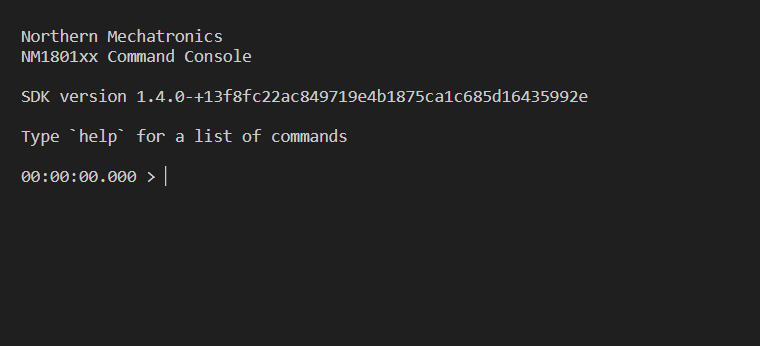

# Northern Mechatronics Application Template

This repository contains an application template that can be used as a starting
point for firmware development with any NM1801xx module from Northern Mechatronics Inc (NMI).

## Hardware Requirements

- A Northern Mechatronics development board (NM180100EVB, NM18041x) OR a user designed board with a NM1801xx target and an SWD port exposed
- A USB cable (for NMI development boards with DAPLink onboard) OR Segger J-Link 

## Software Requirements 

- Microsoft Visual Studio Code 
- Software prerequisites (see our [Getting Started](doc/getting_started.md) guide for details)


## Build the Application

For instructions on how to build this reference application and flash the binary to the NM1801XX, follow along step by step in the [Getting Started](doc/getting_started.md) guide.


## Application Description

This application is designed to be a template upon which all NMI reference examples are built.
The application demonstrates the use of FreeRTOS and toggles an LED every 500ms.

The primary application entry point is `application_task` implemented in `application_task.c`.

The two functions `application_task_setup` and `application_task_loop` are generic tasks that are akin to `setup`
and `loop` in Arduino.  

The code for blinking the LED is implemented inside `application_task_loop`. In this example it calls a FreeRTOS primitive `vTaskDelay` that blocks the task and yields for the specified delay.  


## Interacting with the Application

In addition to blinking an LED, this example also implements a command line interface (CLI) and 
button presses handling that controls LED visual effects.  Short pressing `BTN 0` cycles through LED visual effects.

### Command Line Interface
Users can access the CLI over the UART port *or* the SWD port using Segger RTT (as shown below).  
Only one port can be used at a time and it is specified by the second argument of `console_task_create` called in
`system_start` of `main.c`.  This example defaults to UART0.
If no text appears when using the UART port, press the RESET button and the
welcome text shall be printed on boot.



On the NMI development boards (NM180100EVB, NM18041X), users can access a virtual COM (VCOM) port over USB.  To access the CLI, use any serial terminal and connect to the COM port of the board.  The default terminal
settings are 115200, 8N1.

### Button Press Handling

The button API defined in `button.h` allow users to register different press sequences to a single button that performs different tasks.
To setup a button for press sequence handling, call `button_config` to configure the GPIO line that is connected
to the button as shown in `setup_button` of `application_task.c`.  In this example, a callback is registered to
a single short press by calling `button_sequence_register`.  A press sequence is represented
by a bit pattern of zeros and ones with zero being a short press and one being a long press.  For example, to register
a sequence of five presses starting with two short presses and then three long presses looks like the following:

```
button_sequence_register(button_handle, 5, 0b11100, callback);
```

### LED Control

The LED API defined in `led.h` allow users to execute different LED visual effects.  The LED must be connected to a GPIO with a CTIMER output.

Five effects are available, they are:

* breathing
* single pulse
* double pulse
* triple pulse
* SOS (3 short blinks, 3 long blinks, 3 short blinks)

Additional custom effects can be added by calling `led_register_effect`.

## Drag-and-Drop Firmware Update

The NM18041x Petal development board has an additional feature: mass storage device (MSD) emulation. 

When a NM18041x board is plugged into a host computer, a window will pop up as displayed below and the NMI device will be shown in the File Explorer, similar to a typical USB mass storage device.  Note that this is
not an actual storage medium.

With the pop up window open, drag-and-drop (or copy and paste) a new firmware image to the NMI device will
trigger a firmware update.

After successfully updating the firmware, the pop up window will close automatically. If there is an error during flashing, the window will pop up again with an error file.

